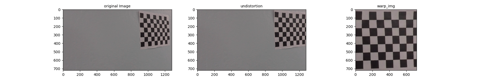
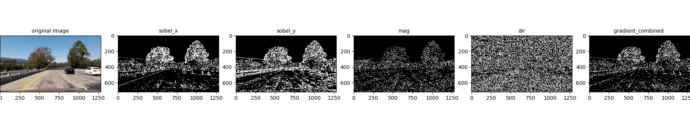
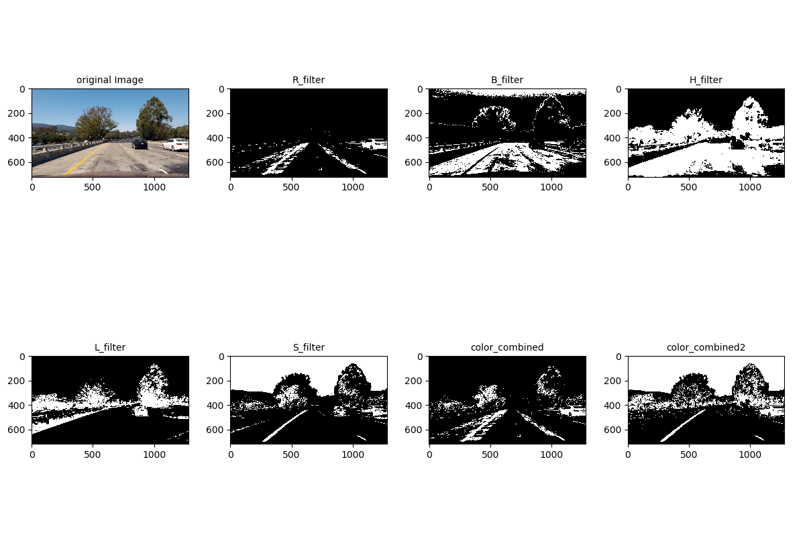
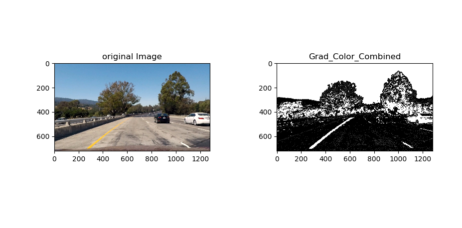
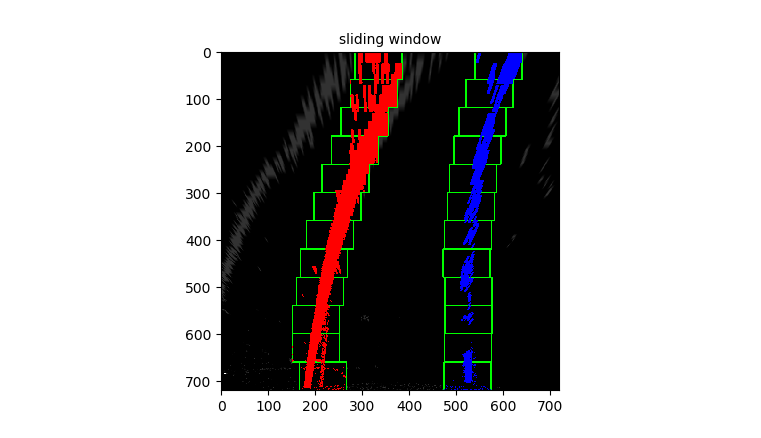

## Advanced lane finding

**Advanced Lane Finding Project**

The goals / steps of this project are the following:

* Compute the camera calibration matrix and distortion coefficients given a set of chessboard images.
* Apply a distortion correction to raw images.
* Use color transforms, gradients, etc., to create a thresholded binary image.
* Apply a perspective transform to rectify binary image ("birds-eye view").
* Detect lane pixels and fit to find the lane boundary.
* Determine the curvature of the lane and vehicle position with respect to center.
* Warp the detected lane boundaries back onto the original image.
* Output visual display of the lane boundaries and numerical estimation of lane curvature and vehicle position.

### Camera calibration

In order to calibrate the camera images, I used checker board images. It is written in calibration.py

First, find the corners of the chess board images by `cv2.findChessboardCorners()`
Second, undistorted the images by `cv2.undistort()`
Third, warp the image by  `cv2.getPerspectiveTransform(src, dst)` and ` cv2.warpPerspective`

The result is:



### Filter the image

By using the color (RGB, HLS) and gradients (sobel, mag, dir), I filter the images

The result is

1. Gradient filter result
2. Color filter result

3. Combine result

The code for filters is written in threshold_filter.py

### Find lane

Then, I find the lanes by sliding window.

The result is: 




### Summary


Above image describes the process of the lane detection.

Step 1. Find calibration matrix. 

Step 2. Undistort the image

Step 3. Filter the image by using gradient and color method

Step 4: Unwarp the image for perspective view

Step 5: Find the lane with sliding window

Step 6: Fill the lane

Step 7: Warp image again

Step 8: Show with origin image


### Discussion

Is there magic formula for filter?

I used color filter and gradient filter like

* ```color_combined2[ (R_binary == 1)&(B_binary == 0) | ((L_binary == 0)&(S_binary == 1) | (H_binary == 1)&(L_binary == 1)&(S_binary == 0))] = 1```
* ```combined[((sobel_x_grad_binary == 1) & (sobel_y_grad_binary == 1)) | ((mag_thresh_grad_binary == 1) & (dir_thresh_grad_binary == 1))] = 1```

But the combination of filters are numerous, so it was hard to choose best one..

Can you recommend the combination of filters?